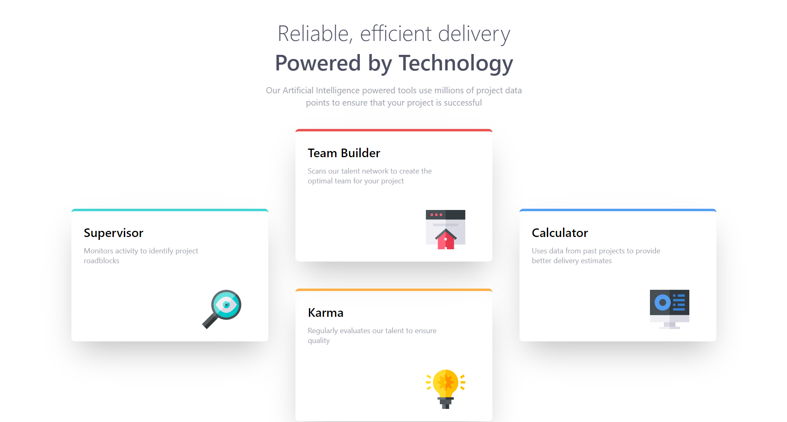

# Frontend Mentor - Four card feature section solution

This is my solution to the [Four card feature section challenge on Frontend Mentor](https://www.frontendmentor.io/challenges/four-card-feature-section-weK1eFYK). Frontend Mentor challenges help me improve my coding skills by building realistic projects. 

## Overview

### The challenge

Users should be able to:

- View the optimal layout for the site depending on their device's screen size

### Screenshot

## My process

### Built with

- Vite
- React Js
- Tailwind Css
- Flexbox
- Mobile-first workflow

### What I learned

I learned how to create a responsive layout using Flexbox. This project also helped me practice my skills in writing clean and maintainable React js and Tailwind Css.

### Continued development

In future projects, I want to further improve my understanding of React js and explore more advanced Tailwind Css techniques.

## Acknowledgments

I'd like to thank Frontend Mentor for providing this challenge and helping me improve my skills.
